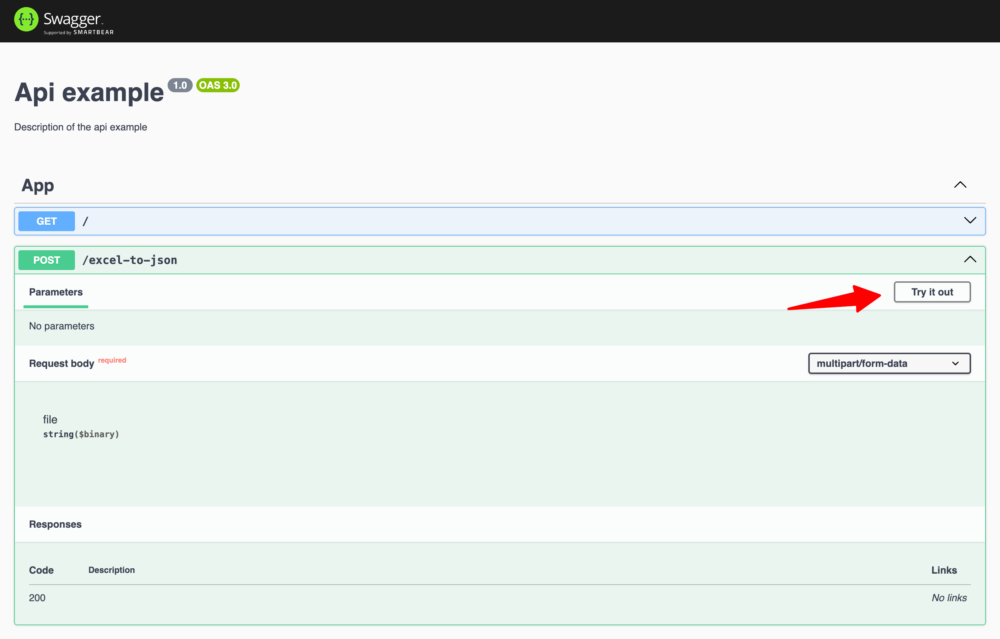
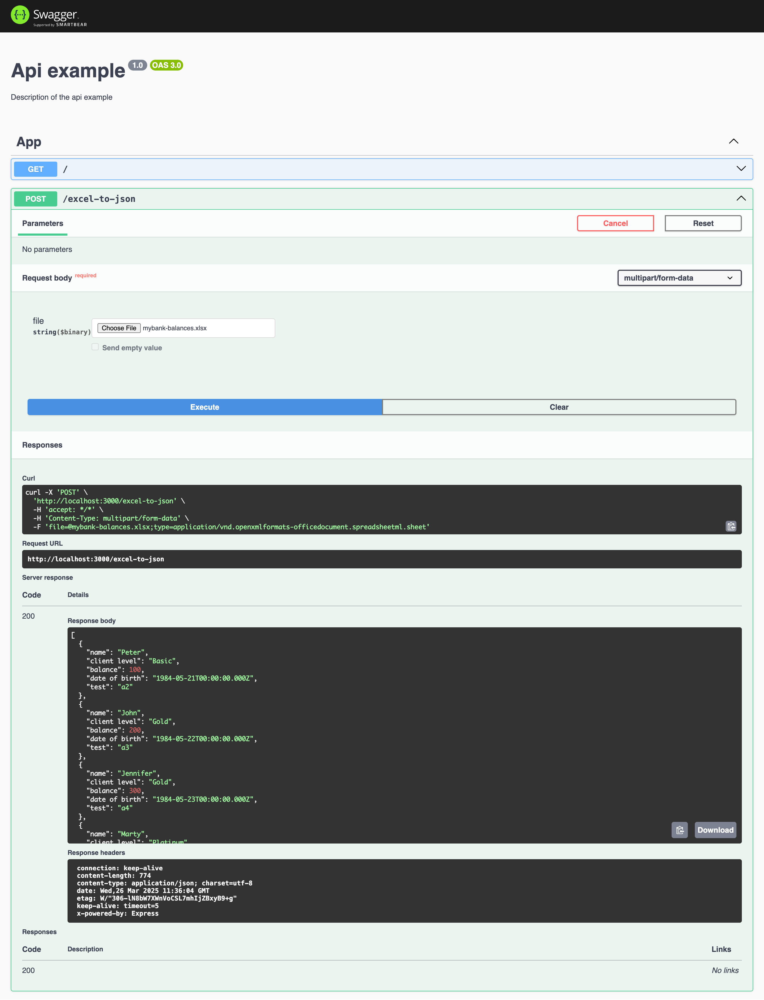

## Description

[Nest](https://github.com/nestjs/nest) framework TypeScript starter repository.

## Project setup

```bash
$ npm install
```

## Compile and run the project

```bash
# development
$ npm run start

# watch mode
$ npm run start:dev

# production mode
$ npm run start:prod
```

## API DOCS

http://localhost:3000/api

# Test Excel to JSON

1. After start project enter in the following link
   http://localhost:3000/api#/App/AppController_uploadFile
2. Click Try out
   
3. Upload the file and see the result JSON
   

## Run tests

```bash
# e2e tests
$ npm run test:e2e

# unit tests
$ npm run test

# test coverage
$ npm run test:cov
```

## License

Nest is [MIT licensed](https://github.com/nestjs/nest/blob/master/LICENSE).
